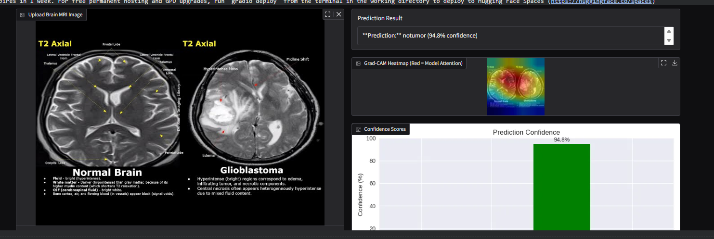

# brain-tumor-xai-mlops
Brain Tumor Detection using Deep Learning with Explainable AI and MLOps
# 🧠 Brain Tumor Detection using Explainable AI & MLOps

## 📌 Project Overview

This project focuses on detecting brain tumors from MRI images using deep learning techniques. It integrates Explainable AI (Grad-CAM) to interpret model predictions and applies MLOps concepts for deployment and real-world usability.

---

## 🎯 Objectives

* To classify brain MRI images into tumor and non-tumor classes
* To build a Convolutional Neural Network (CNN) model for image classification
* To implement Explainable AI (Grad-CAM) for model interpretability
* To deploy the model for real-time predictions

---

## 📂 Dataset

* MRI Brain Tumor Dataset
* Classes:

  * Glioma
  * Meningioma
  * Pituitary
  * No Tumor

---

## ⚙️ Technologies Used

* Python
* PyTorch
* NumPy, Pandas
* Matplotlib, Seaborn
* OpenCV
* Grad-CAM
* Streamlit / FastAPI (for deployment)

---

## 🧠 Model Architecture

* Convolutional Neural Network (CNN)
* Layers used:

  * Convolutional layers
  * ReLU activation
  * MaxPooling
  * Fully connected layers

---

## 📊 Results

* Achieved good accuracy on test dataset
* Model successfully classifies tumor types
* Performance evaluated using:

  * Accuracy
  * Confusion Matrix
  * Classification Report

---

## 🔍 Explainable AI (Grad-CAM)

Grad-CAM is used to visualize the important regions of the MRI image.

👉 The highlighted regions indicate where the model focuses while making predictions.

---

## 📈 Visualizations

* Loss vs Epoch graph
* Accuracy vs Epoch graph
* Class distribution plots

---

## 📷 Project Output

### 🧠 Prediction Result with Explainable AI



**Prediction:** Notumor (94.8% confidence)

👉 The model classifies the MRI image and provides confidence scores.
👉 Grad-CAM heatmap highlights the important regions where the model focuses.
👉 The highlighted regions indicate the areas of interest used by the model for prediction.

---

## 🚀 How to Run the Project

1. Install dependencies:

```
pip install -r requirements.txt
```

2. Run the notebook:

```
jupyter notebook
```

3. (Optional) Run deployment:

```
streamlit run app.py
```

---

## 📦 MLOps Features

* Model saving and loading (.pth file)
* Deployment-ready pipeline
* Scalable for real-world applications

---

## 👩‍💻 Author

**Reshma Jadhav**
Bangalore, Karnataka

---

## ⭐ Conclusion

This project demonstrates the application of deep learning in medical image analysis along with Explainable AI and MLOps, making it suitable for real-world healthcare solutions.
